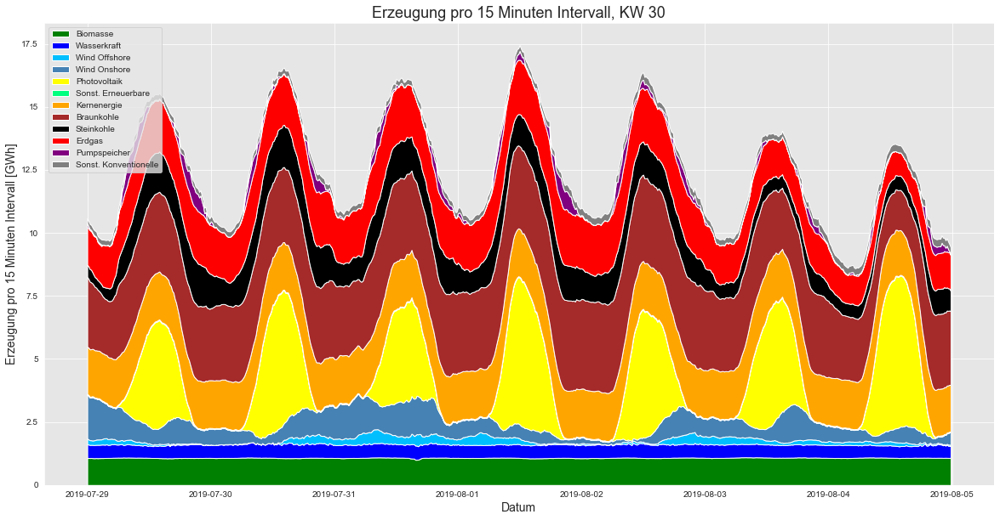

# Overview

This is a notebook which I presented internally at my lab, to showcase some energy system data analysis. It was inspired by the OPSD tutorial (https://data.open-power-system-data.org/time_series/2020-10-06).

# Requirements
This notebook uses [Brightway2](https://documentation.brightway.dev/en/latest/index.html), data from the [Ecoinvent](https://ecoinvent.org/) 3.6 database, and data from the German grid data portal [SMARD](https://www.smard.de/home/downloadcenter/download-marktdaten/).

# Tips
You can view the notebook as a slideshow if you open the notebook in Jupyter Notebooks and navigate to View > Cell Toolbar > Slideshow (slideshow does not include all the content of the notebook, it skips some peripheral info).

You can also view the notebook using [Jupyter Notebooks Viewer](https://nbviewer.org/) and pasting the URL from this repository.

# License
MIT License, see file 'License.txt'

 
